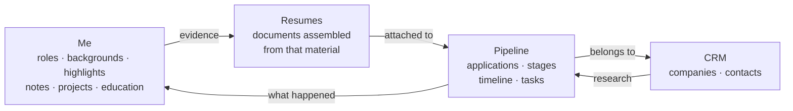

Hired is four areas that only make sense as a chain. Material flows one way: what you
did becomes evidence, evidence becomes a document, the document goes out to a company,
and what happens next comes back as a record.

The loop at the end is the part people miss. An interview that went well is not just a
stage change — it is new material about you, and it belongs back in Me so the
next resume is better than this one.

## The four areas

<CardGroup cols={2}>
  <Card title="Me" icon="user" href="/concepts/me">
    Everything you know about your own career, stored raw. Roles hold an unlimited
    free-form background plus polished reusable bullets called highlights. There are
    also notes, projects, education, skills and certifications.
  </Card>
  <Card title="Resumes" icon="file-lines" href="/concepts/resumes">
    Documents assembled from that material. One JSON contract shared by the editor, the
    renderer and the tools, so a half-written document still renders.
  </Card>
  <Card title="Pipeline" icon="list-check" href="/concepts/pipeline">
    Applications through six stages, with an activity timeline, tasks, and follow-up
    dates that set themselves when a stage changes.
  </Card>
  <Card title="CRM" icon="building" href="/concepts/crm">
    Companies and the people at them, as records in their own right — with their own
    research notes and their own timelines.
  </Card>
</CardGroup>

## The vocabulary

These words mean something specific here. Using them gets you what you meant.

| Word | What it is |
| --- | --- |
| **Role** | One job you have had. Holds dates, a scope summary, tags, and the background. |
| **Background** | Unlimited raw text about a role. Not a document — nobody reads it directly, it gets searched. |
| **Highlight** | One polished, reusable achievement bullet, rated 1–5 for strength and tagged for retrieval. |
| **Note** | Free-floating material that belongs to no single job. STAR stories, comp history, references. |
| **Guardrail** | A note promoted to a standing rule. It rides along in the briefing every assistant receives. |
| **Extra** | Education, projects, skill groups and certifications — the four supporting collections. |
| **Resume** | A saved document plus its design settings. Can be published, exported, duplicated. |
| **Application** | One job you are chasing at one company. Carries the posting, a stage and a timeline. |
| **Stage** | Where an application sits on the path. Six of them, ending in accepted or lost. How deep the interviewing got is a round number on the application, and why a lost one ended is a tag. |
| **Activity** | One thing that happened, on an application or with a person. Twelve types. |
| **Tag** | A label you own — a name and a colour. Files applications by where they came from, companies by industry, size and location, and people by how you know them. Several at once is normal. |
| **Saved view** | A named cut of the pipeline — the filters, sort and search, kept under a name. |
| **Connection** | One assistant's URL into your workspace. You have as many as you have clients. |

## Two rules that explain most surprises

### Some tools replace, some append

This is the single most important mechanical fact about the product, because getting it
wrong deletes work silently.

| Tool | What it does |
| --- | --- |
| `append_role_background` | **Adds** to the end. Safe by default; prefer it. |
| `update_role` | **Replaces** every field you pass, `background` included. |
| `update_resume` | **Replaces** the whole document. |
| `update_company` | **Replaces** each field passed, `notes` included. |
| `update_contact` | Same. |
| `update_application` | Same, and `tags` replaces the whole list. |

The rule an assistant is given: read first, modify, write back whole. When somebody tells
it something *new* about a job already on file, that is
`append_role_background` — not `update_role`.

### Isolation is not a setting

Every workspace is private, and that is a property of the code rather than a permission
you can misconfigure. Every function that touches content takes the owning account as its
first required argument, and every query filters on it, so a call site that forgot is a
call site that does not compile.

Admins manage *accounts* — invitations, suspensions, password resets, instance
configuration. There is no path, through the app or through an assistant, from an admin
to another person's career history, resumes or applications.

[The full security model →](/reference/security)

## Where the work actually happens

Both surfaces run on exactly one implementation of every rule, so anything an assistant
writes shows up in the app immediately, and anything you edit in the app is what the
assistant reads next.

<CardGroup cols={2}>
  <Card title="In conversation" icon="comments">
    Everything. Every capability in the product is reachable as a tool — that is the
    project's own rule, and a feature is not considered finished until it is.
  </Card>
  <Card title="In the browser" icon="window-maximize">
    The direct-manipulation half: dragging a card between stages, typing into the resume
    editor, looking at the paper, printing the page.
  </Card>
</CardGroup>
