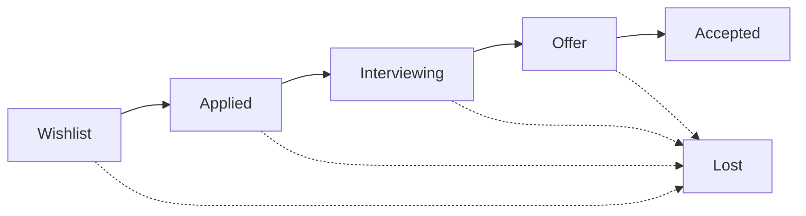

An application is one job you are chasing at one company. It carries the posting, a
stage, a timeline of everything that happened, and the dates that decide what you do next.

## The six stages

Four are positions on the path. Two are endings.

| Stage | Label | Means |
| --- | --- | --- |
| `WISHLIST` | Wishlist | Interested, nothing sent. |
| `APPLIED` | Applied | Sent. |
| `INTERVIEWING` | Interviewing | Talking to them, at any depth. |
| `OFFER` | Offer | They made one. |
| `ACCEPTED` | Accepted | Signed. |
| `LOST` | Lost | It ended without an offer. |

The first four are the board columns. The two endings get their own view below it.



Solid arrows are progress; dotted ones are the ending, and an application can reach it
from anywhere. Nothing enforces the order — you can move a card straight from the wishlist
to an offer if that is what happened.

### How deep you got is a number, not a column

Screening, interviewing and a final round used to be three of those columns. They were one
thing — talking to them — and which column a given employer's process belonged in was a
guess that changed by employer. They are one stage, and how far in you are is a **round**:
a number you set on the opened application, with an optional name for what that round was.

The board shows none of it, deliberately. A card should say as little as possible. The
round is what the funnel on **Analytics** is built from: with no rounds recorded it draws
Applied → Interviewing → Offer, and with rounds it draws Applied → Round 1 → Round 2 → …
→ Offer, which is where knowing you stall at round three is worth something.

### Why it ended is a tag

Rejected, withdrawn and ghosted were three more columns for one thing: it is over and you
did not get it. That is `LOST`, and **why** is a [tag](/concepts/tags) of kind `LOSS` — a
row you own, so you can rename it, recolour it, delete it, and add the reasons no enum
would have had. The five it starts with are Rejected, Ghosted, Withdrew, Declined their
offer and Role closed. An application can carry more than one.

<Warning>
  **Say why, especially when the answer is silence.** Silence is the most common ending in
  any search, and a `LOST` with no reason on it tells the funnel only that it stopped. A
  rejection is a decision against you; a ghosting is a non-response — and the advice that
  falls out of those two is completely different. It is one click at the moment you close
  the job out.
</Warning>

Colour carries progress the same way it always did: hue rotates in one direction as an
application advances — steel, violet, then gold at the offer — so two chips read as
"further along" without you knowing which label is which. Inside interviewing the rounds
inherit the three hues the three old stages wore, so a deeper round still looks deeper.
The endings sit outside the rotation, and `LOST` is deliberately muted rather than alarm
red: most applications end, and a wall of red says a search is failing when it is doing
the normal thing.

### An ending is not a deletion

`LOST` and `ACCEPTED` close an application and keep it: it drops off the
board, stays in the funnel, and `list_applications` returns it with `includeClosed`. That is
what you want for almost everything that ends, because a rejection you cannot count is a
rejection you cannot learn from.

Deleting is the other thing, and it is reversible. `delete_application` puts the row in the
[archive](/tools/archive), where it leaves every list, board, picker, filter and count and
waits — thirty days by default — before it is deleted for good. `restore_records` brings it
back. If you want it out of the way but still counted, close it; if you want it gone, delete
it and the archive holds the door open.

## Capturing something

<CardGroup cols={2}>
  <Card title="From a URL" icon="link">
    `capture_job_posting` fetches the page server-side, reads the structured posting data
    most job boards publish, and creates the application in one move — company matched or
    created with its own website, role title, full description, location, compensation
    and where it came from, starting on the wishlist.
  </Card>
  <Card title="By hand" icon="pen-to-square">
    `create_application` needs only `company` and `roleTitle`. The company is created
    automatically if it does not exist yet.
  </Card>
</CardGroup>

When a page does not state the employer or the role readably, `capture_job_posting`
returns `captured: false` with whatever it *did* parse and creates nothing — deliberately,
because an employer guessed from a URL is worse than an employer you were asked about.

<Tip>
  Paste the **whole** posting into `jobDescription`. It is what a resume gets tailored
  against later, and postings disappear from the web the moment the role is filled.
</Tip>

### A listing is optional

A role you are chasing through a LinkedIn DM with no posting at all is still an
application. Track it with just company and role title, put `Cold outreach` in `tags`,
and attach the person you messaged as a contact.

### Tags

`tags` is a list, because a job board posting, a referral and a LinkedIn message are often
the same job. It is where an application came from, and anything else you want to file it
under.

Tags are records you own, not free text: each one is a name and a colour, and `list_tags`,
`create_tag`, `update_tag` and `delete_tag` manage them. The same table holds the labels on
companies and people — `kind` says which list a tag belongs to, so a location called
`Remote` never collides with a way of working called `Remote`. Deleting a tag takes it off
everything that carried it and leaves those records otherwise untouched — and unlike a
company, a person or an application, a tag really is gone rather than going to the archive.
A label is not a record with a history: what wore it is untouched apart from no longer
wearing it, and a label you cannot remove is worse than one you delete by mistake.

Write them by `tagIds` when you have them, or by name in `tags`. Names are matched
case-insensitively against what exists — `linkedin` lands on your existing `LinkedIn` — and
a tag is created only when nothing matches. Call `list_tags` first either way.

<Note>
  Both `tagIds` and `tags` REPLACE the whole set on an application, like every other array
  in this API. Read the current one with `get_application` before writing it back.

  `sources`, `sourceIds` and `source` still work: tags were called sources until they grew
  to cover companies and people too. `tags` wins wherever both are passed.
</Note>

A new workspace is offered LinkedIn, Job board, Company site, Referral, Recruiter reached
out and Cold outreach as a one-click start. They are a seed, not a fixture: accept them and
they are your rows, to rename, recolour or throw away.

## The timeline

Every application has one, and everything that happened goes on it. Twelve activity types:

`NOTE` · `STAGE_CHANGE` · `EMAIL_SENT` · `EMAIL_RECEIVED` · `CALL` · `INTERVIEW` ·
`FOLLOW_UP` · `APPLIED` · `OFFER` · `REJECTION` · `REFERRAL` · `OUTREACH`

`OUTREACH` is for a message you sent first — a DM to a hiring manager, a cold email.
Half of some searches happen there, before or instead of a formal application.

Moving a stage writes its own timeline entry and resets the follow-up date, so
`move_application_stage` is one call rather than two. Do not also log the change by hand.

<Note>
  Write the entry the way you said it. "Recruiter said the team is six people and they
  want someone to own billing end to end" is worth far more in three months than "had a
  call" — and it is what makes a follow-up message refer to something real.
</Note>

## Follow-ups that set themselves

Changing stage schedules the next nudge automatically, for 9am on the day it falls:

| Entering | Nudge after |
| --- | --- |
| `APPLIED` | 7 days |
| `INTERVIEWING` | 4 days |
| `OFFER` | 2 days |

Moving to `WISHLIST` schedules nothing. Moving to either ending **clears** any
follow-up date the application had and stamps it closed — a finished application should not
keep nagging you. Override any of it by hand: `nextFollowUpAt` on the application, or the
cell in the table.

Moving out of `WISHLIST` for the first time also stamps the applied date, if it was not
already set.

Contacts have their own version: `nextFollowUpAt` on a person is where "ping Sarah in two
weeks" lives. In the app, both land on **Tasks**.

### Three ways to ask what is due

<CardGroup cols={3}>
  <Card title="list_follow_ups" icon="bell">
    What is already due, or due within N days. Returns two lists: applications whose date
    has arrived, and contacts whose ping has. Both are work.
  </Card>
  <Card title="list_schedule" icon="calendar-days">
    Everything dated between two dates, merged and sorted: follow-ups, task deadlines and
    activity already logged. The right call for "what does my week look like".
  </Card>
  <Card title="list_tasks" icon="square-check">
    To-dos, with or without a due date, and about at most one thing: an application, a
    company, a person, a resume, a role in Me, a note — or nothing at all. `update_task`
    moves one, `complete_task` ticks it off, `delete_task` removes it.
  </Card>
</CardGroup>

## Reading the search

`pipeline_stats` gives you the counts: by stage, active, sent this week, interviews,
offers, open tasks, follow-ups due, response rate.

`diagnose_search` gives you the answer. It returns a one-sentence verdict naming which
step of the funnel is losing people — no responses at all is a resume or targeting
problem, responses that die at the phone screen is a story problem, interviews that do
not convert is something else again — plus per-step conversion, median days in each
stage, weekly volume for the last six weeks, applications that have gone quiet, and the
response rate of each resume so you can see which one is working.

Progress is measured by the furthest an application ever got — its round, where it has
one — so a rejection after a fourth round counts as having got that far. When there is not enough data yet, it
says so plainly rather than inventing a trend.

<Tip>
  Reach for `diagnose_search` before giving or taking advice about a search. It is the
  difference between "send more applications" and "stop sending, the resume is the
  problem".
</Tip>

## Views and cuts

The pipeline toolbar picks the view — a drag-and-drop **board**, a sortable **table**, or
a month **calendar** of everything with a date on it — plus a filter and a search.

Filters combine — all of them, with each other. "Applied and interviewing" is one view
rather than two trips, and so are "interviewing but only the overdue ones" and "closed, but
only the ghostings".

Everything lives behind the **Filter** button beside the search: the stage, its tags, the
company, which resume went out, how long it has sat still, and how much you want it. It
opens on the dimensions rather than on every value at once — click **Stage** and you get the
stages, click **Company** and you get companies — and typing searches across all of them
together, saying which dimension each match came from. Every count you see is counted
against the rows the other filters left, so a row never claims twelve when the search has
left one.

Two chips stay above the board: **Everything**, and **Needs a nudge**. The stages used to sit
beside them as a row you scrolled sideways, above a board whose columns are the stages;
they are a dimension like any other and they live in the menu now. What is overdue is not —
the front page is built around it and the bell counts it, so it stays one click from
anywhere.

Location and work mode are free text and stay that way — "Remote (US, PST overlap)" is a
real answer no list survives — but the field offers what you have already used, most-used
first, so a workspace does not end up with three spellings of Remote. `list_field_values`
is the same list over MCP, and it is the call to make before writing either field.

The table edits in place: stage, follow-up, salary and location are the cells themselves,
and selecting rows closes a batch out in one action. Two columns count days: **Waiting** is
days in the current stage, **Quiet** is days since anything was logged. A call you noted
yesterday resets Quiet and leaves Waiting alone, which is why chasing is decided on the
second one — `qd` filters on it and `sort=quiet` orders by it.

A cut worth keeping gets saved under a name. A saved view stores the pipeline URL's own
parameters:

```
view=list&f=APPLIED,INTERVIEWING&sort=waiting&dir=desc
```

| Parameter | Values |
| --- | --- |
| `view` | `board`, `list`, `calendar` |
| `f` | Comma-separated stages, plus `overdue` as a flag. `closed` expands to the four endings. |
| `src` | Comma-separated tag ids. Spelled `src` because tags were called sources when saved views started storing them, and renaming it would break every view already saved. |
| `co` | Comma-separated company ids |
| `cv` | Comma-separated resume ids, or `none` for the ones with no resume attached |
| `w` | Minimum days sitting in the current stage |
| `sort`, `dir` | Column and direction |
| `q` | Search text — company, role, notes, location, work mode, the posting, and tag names |
| `month` | `YYYY-MM`, for the calendar view |

Saving under a name that already exists replaces that view, which is how you edit one.
Anything outside those parameters is dropped, and they are always written in that order —
so the same view saved twice is the same string.

<Note>
  `co` and `cv` hold ids, which survive a rename but not a delete. A saved view naming a
  company you later merged away simply stops matching it; nothing breaks, and clearing that
  filter fixes it.
</Note>

## Sharing the board

`share_pipeline` mints a read-only link at `/p/<slug>` for a friend, a coach or a former
manager who is helping you review the search. What a viewer sees is deliberately narrow:

<CardGroup cols={2}>
  <Card title="They see" icon="eye">
    Company, role, stage, location, how long each has been sitting, and when a follow-up
    is due. Optionally the closed applications too.
  </Card>
  <Card title="They never see" icon="eye-slash">
    Notes, job descriptions, salary, contacts, or the activity timeline.
  </Card>
</CardGroup>

Calling it twice returns the same link rather than a second one. `unshare_pipeline`
**destroys** the address rather than pausing it — sharing again later mints a completely
different URL — because the reason to revoke is usually that a link reached someone it
should not have, and a pause you can undo does not fix that.

## In the app

**Today** — the front page — leads with what is due, and the bell in the top bar carries
the count of it on every other screen. Its second tab, **Analytics**, is where the numbers
went: the funnel drawn as a flow chart, the diagnosis, the response rate, and a **Share
chart** button that hands you the flow chart as a PNG or an SVG with no company or role
name anywhere on it. **Pipeline** is the board, table and calendar. Opening an application slides it in from the right, so you keep your
place on the board — posting, timeline, contacts, tasks and the resume you attached, all
on one panel.

Every view also decides how much it shows before you open anything. The **Fields** button
picks per view — a board card, a table row and a calendar chip have nothing in common except
that all three can be too busy — and the choice follows you between devices rather than
living in the URL, because a saved view is a cut of the data and this is not. The same is
true of how wide each column of the table is: drag the divider between two headings and the
width is saved to your profile, so it is the same on your laptop and your phone. The company
column takes whatever the rest leave, which is why widening one narrows it rather than
pushing the table off the side. `get_column_widths` and `set_column_widths` are the same
thing over MCP.

On the board
and in the table, the company, the role title and the stage are never in the list: a card
without them is not shorter, it is unreadable, and in the table the stage cell is the editor
the table exists for. The calendar is the exception, and only for stage — a chip is one line
of an entry's own title, so the stage is genuinely extra there, and it is off by default.

**Today** is the page you clear the list from, and it is what `/` opens to — the numbers
used to sit there and now sit one tab over, because you open this app to do the next thing
rather than to read your own statistics. Two columns, deliberately not merged: the things you wrote down, grouped by overdue,
today, the next seven days, later and undated — each one rewordable, re-datable and
attachable to a role in place — and beside them the chase list, the follow-ups and pings
whose dates have come round, where the verbs are "logged it" and "push it out three days".
Ticking a task and logging a chase mean different things, so they do not share a column.
Scheduling a new ping lives there too.

Everything here is reachable by conversation — see [the pipeline tools](/tools/pipeline).
